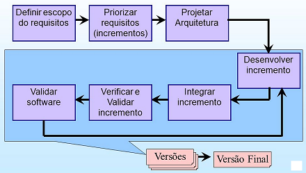

<h1 align="center"><u>Linguagem UML</u></h1>
<h2>Sobre a UML</h2>
<a src="https://www.uml.org">Site oficial da Linguagem</a>  
<a src="https://www.omg.org/spec/UML/About-UML/">Site da OMG</a>

<h2>Diagramas UML</h2>
<ul>
    <li>
    <b>Diagramas Comportamentais:</b> Destacam o que irá ocorrer no processo de negócio ou sistema. São utilizados para detalhar as funções de um sistema. Como exemplos, temos os diagramas de atividades, máquinas e estado.
    </li>
    <li>
    <b>Diagramas de Interação:</b> Detalham os fluxos para controlar os distintos elementos de um sistema, sendo um subconjunto dos diagramas comportamentais. Como exemplos, podemos mencionar os diagamas de tempo, comunicação, visão geral de interação e sequência.
    </li>
    <li>
    <b>Diagramas Estruturais:</b> Definem o que deverá ser desenvolvido em relação aos componentes do sistema. São benéficos para definir a arquitetura de um sistema que não depende do tempo. Como exemplo, tmos os diagramas de perfil, objetos, pacotes, classes, implantação, componentes e estrutura composta.
    </li>
</ul>

<h2>Metodologias de Desenvolvmento de Sistemas</h2>
<ul>
    <li>
    <b>Tradicionais:</b> Metodologias incrementais, espiral e cascata.
    </li>
    <li>
    <b>Ágeis:</b> Scrum, XP, Cleanroom, etc.
    </li>
</ul>

Artigo:
<a src="www.linhadecodigo.com.br/artigo/2108/evolucao-da-metodologia-do-desenvolvimento-de-sistemas.aspx">Evolução da Metodologia do Desenvolvimento de Sistemas</a>

Vídeo: 
<a src="www.linhadecodigo.com.br/artigo/2108/evolucao-da-metodologia-do-desenvolvimento-de-sistemas.aspx">APS Modelos Cascata, Iterativo Incremental, Prototipação, Espiral e Métodos Ágeis</a>

<h2>Ciclo de vida padrão para o Desenvolvimento de Sistemas</h2>
<ul>
    <li>
    <b>Análise:</b> Engenharia de Requisitos: especficação e análise de requisitos. 
    </li>
    <li>
    <b>Projeto:</b> Arquitetura e Modelos.
    </li>
    <li>
    <b>Implementação:</b>  Codificação e desenvolvimentos do Sistema.
    </li>
    <li>
    <b>Teste:</b>  Testes, Validação e Qualidade.
    </li>
    <li>
    <b>Implantação:</b> Instalação, Suporte e Manutenção;
    </li>
</ul>

<h3>Levantamento de Requisitos</h3>

Esse levantamento tem por objetivo entender o problema a se resolvido e definir "o que" é esperado do software, identificando se há possibilidade de desenvolvê-lo. Isso é feto por meio de entrevistas com o analista de sistemas, engenheiro de software, desenvolvedores etc. (representando a TI), que pocuramcompreender a necessidade do cliente (usuário) e quais funcionalidades e qual desempenho são esperados do software.

<ul>
    <li>
        <b>Requisitos Funcionais:</b> Determinam as funcionalidades do sistema.
    </li>
    <li>
        <b>Requsitos não funcionais:</b> Definem caracteísticas de qualidade que o sistema deverá contemplar.
    </li>
    <li>
        <b>Requisitos Normatvos:</b> É a definição das restrições existentes.
    </li>
</ul>

<h3>Análise dos requisitos</h3>

A análise de requisitos diz respeto às etapas de levantamento e análise de requisitos. Com o levantamentoconcluído , a fase da análise, também conhecida como análise ou especificaçãço de esuisios, permitirá qe os profissionais envolvdos - como o analista de siatemas - realizem o estudo com base na documentação do escopo, a fim de criar modelos com UML para representar o sistema. Dessa maneia, pose-se validar se todos estão em conformidade com o que está na documentação e se p sistema em questão realmente é viável.

<h3>Projeto(desenho)</h3>

A fase de projeto ou desenho é voltada para a solução, buscando determinar o meio como o software realizará o que foi especificado na etapa de análise.  A maior parte da arquitetura do sistema é concebida nessa fase, quando é levado em conta se os recursos de tecnologia estão disponíveis para sanar o problema reportado pelo cliente, qual linguagem de programação será empregada, como será a interface, qual será o SGBD, como o sistema será compartilhado , entre outros detalhes pertnentes à arquitetura.

<ul>
    <li>
    <b>Projeto detalhado (projeto de baixo nível):</b> Realiza-se a modelagem das associações entre objetos de cada módulo, visando implemntar as funcionalidades. Os diagramas da UML usados nessa etapa são os de classes, casos de uso, interação. estados e atividades.
    </li>
    <li>
    <b>Projeto da arquitetura (projeto de alto nível):</b> As classes de objetos do sistema são distribuidoas em subsistemas e componentes. O diagrama da UMl usado é o de implementação.
    </li>
</ul>

<h3>Implementação (programação) e Testes</h3>

Na etapa de implementação, a equipe de desenvolvimento realiza <b>a codificação (programação) do sistema</b>, emque o detalhamento provido pela etapa de projeto é traduzido para uma ou mias linguagens de programação.

Após a implementação, temos a fase de testes, isto é, quando vários procedimentos são executados para nos certificamos de que o softwae desenvolvido está rodando sem eros, de acordo com o detalhamento realizado na etapa do projeto.

<h3>Implantação</h3>

Nesta fase o sistema é compartilhado e implementado no ambiente especificado pelo cliente. Os manuais do software também são desenvolvidos nessa etapa, bem como os arquivos são carregados, as informações cruciais são importadas e os usuários recebem um treinamento para usar o sistema de maneira adequada.
